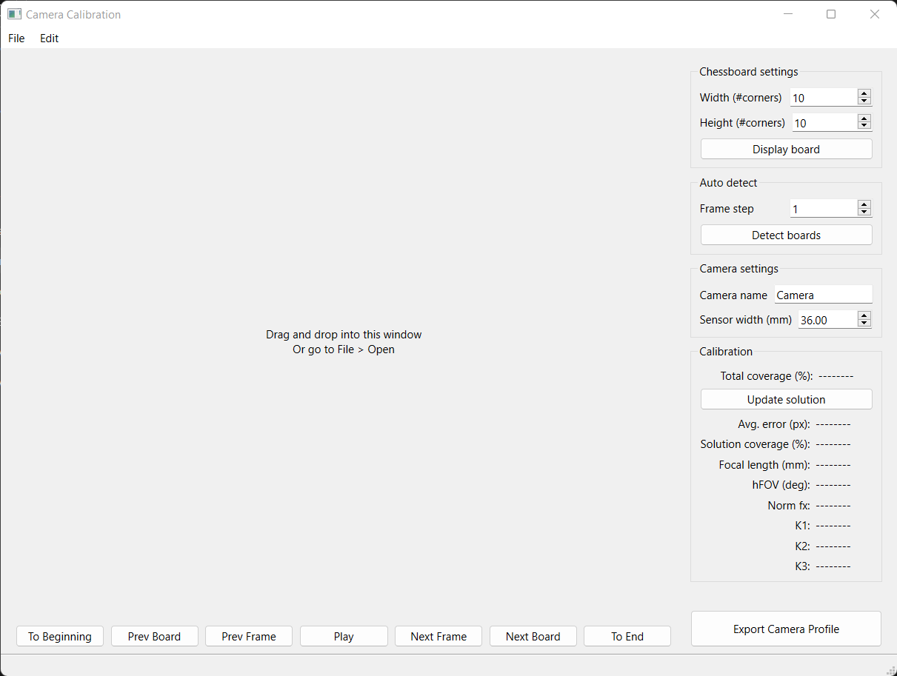
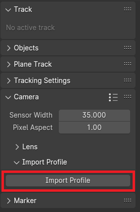

# Blender-Camera-Calibration-Tool
This is a simple GUI application meant for use in Blender motion tracking applications. It uses OpenCV to perform the same grid-based chessboard calibration as mentioned in the [Blender Manual](https://docs.blender.org/manual/en/latest/movie_clip/tracking/introduction.html#manual-lens-calibration).

Prebuilt binaries are currently only available for Windows. Other binaries for Linux and macOS will be available soon.

## Features
* Pattern display for quick calibration setup
* Batch pattern detection with Auto detect
* Manual per-frame pattern detection
* Automatic pattern selection for best results
* Keyboard shortcuts for most actions
* Profile exporting->importing for Blender

## Usage
The following programs can be found in [Releases](https://github.com/YaannSloot/Blender-Camera-Calibration-Tool/releases):
* calibration.exe - The actual standalone calibration application
* import-tool.py - The Blender add-on which imports camera profiles generated with calibration.exe

### Calibration tool

### Options
* ### Chessboard settings
	- Width (#corners) - Should be one less than the number of horizontal squares
	- Height (#corners) - Should be one less than the number of vertical squares
	- Display board - Displays this pattern in a separate window
* ### Auto detect
	- Frame step - Step size for transcoder
	- Detect boards - Start auto detection
* ### Camera settings
	- Camera name - Name that will be exported in camera profile
	- Sensor width (mm) - Horizontal width of camera sensor. If this value is not known just leave it at the default.
* ### Calibration
	- Update solution - Update the current solution, reselecting the 10 best patterns for full coverage

For easy calibration, use **Display board** and record your screen using the camera you want to calibrate. You should move the camera in a scanning pattern, making sure that all portions of the chessboard are visible. 

Use the auto detect feature with a step size of 10.
You should ideally obtain a total coverage value of >80%. Update your solution and export your camera's profile.

Solution values and what they mean:
| Name | Description |
| ---- | ----------- |
| Total coverage (%) | Total percent of video area currently covered by all detections |
| Avg. error (px) | Average reprojection error |
| Solution coverage (%) | Percent of video area covered by last solution |
| Focal length (mm) | Estimated focal length (`norm_fx * sensor_width`) |
| hFOV (deg) | Estimated horizontal FOV based on focal length | 
| Norm fx | Normalized horizontal focal length |
| K1 | First distortion coefficient |
| K2 | Second distortion coefficient |
| K3 | Third distortion coefficient |

### Import tool

Once import-tool.py has been installed as an Add-on, it can be found in Movie Clip Editor > Sidebar > Track > Camera > Import Profile.

Imported profiles will be added as a camera preset, with the name matching what was set in the calibration app.

## Building
Use CMake 3.16 or greater

Depends on: \
OpenCV 4.7.0 or greater \
Qt 6.5.4 or greater \
Boost 1.85.0 or greater

Using static builds of Qt and OpenCV are highly recommended for portability